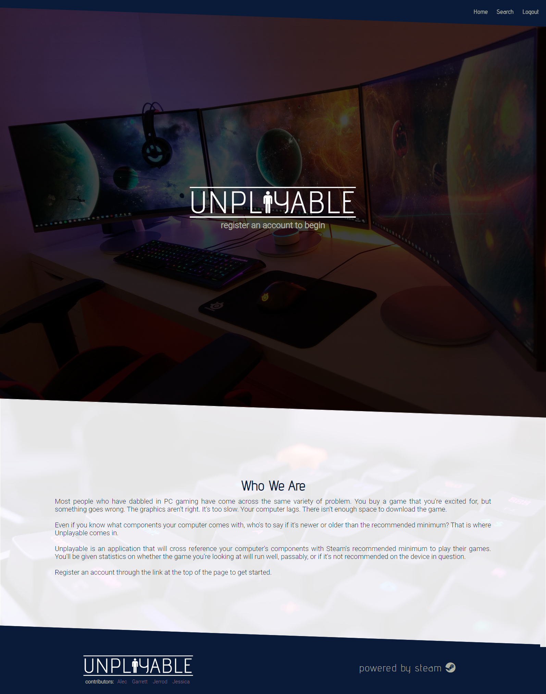
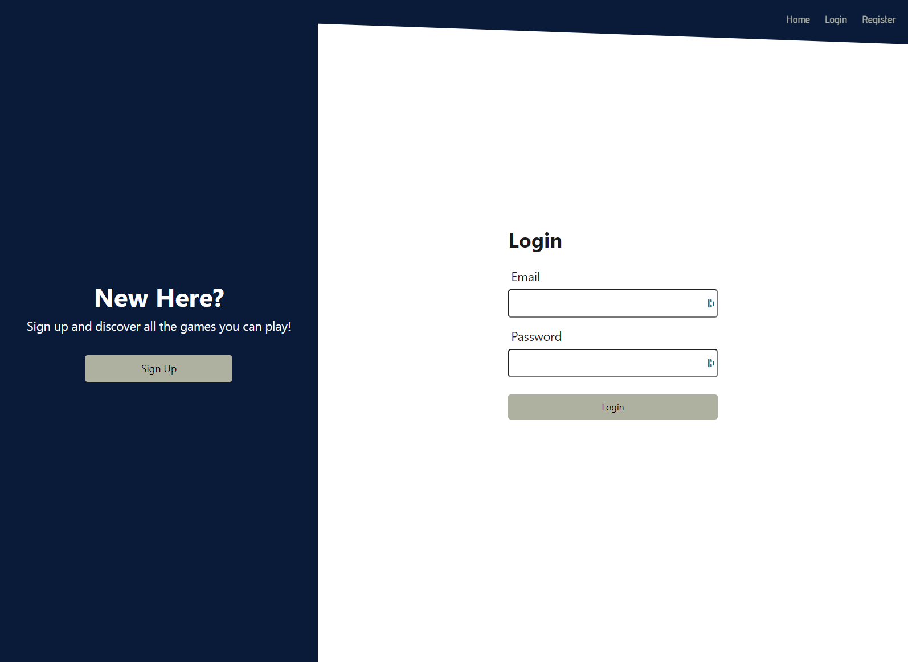
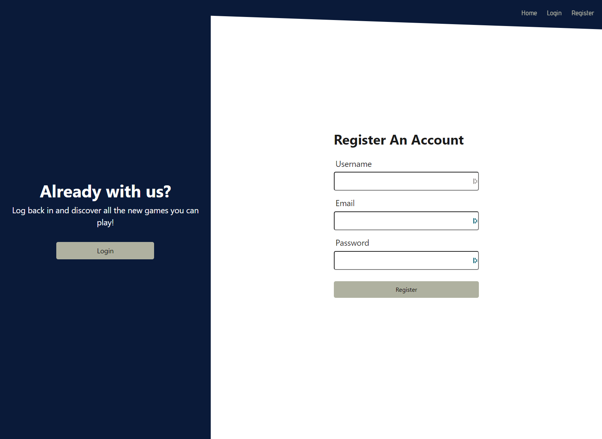
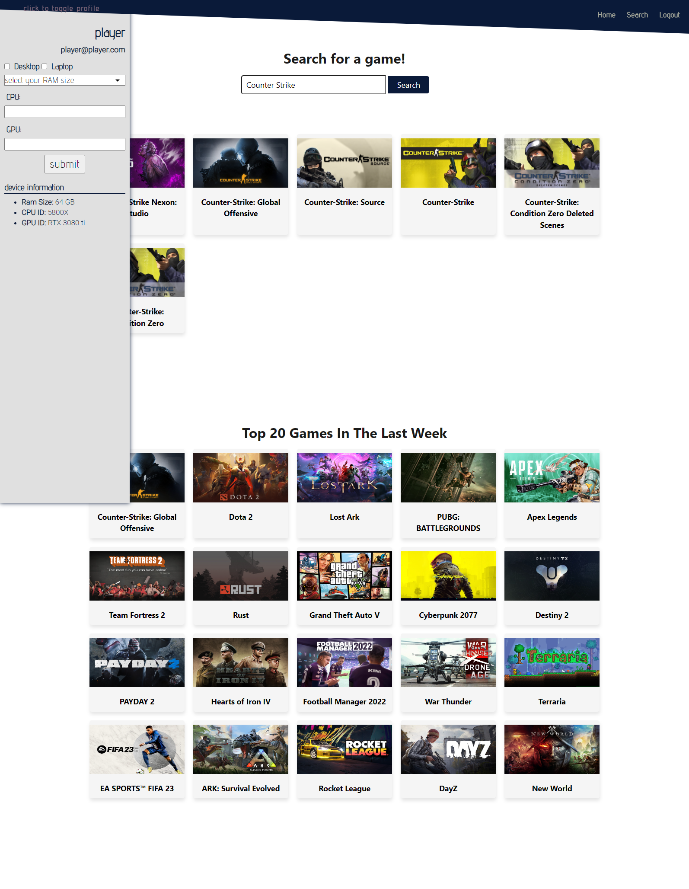
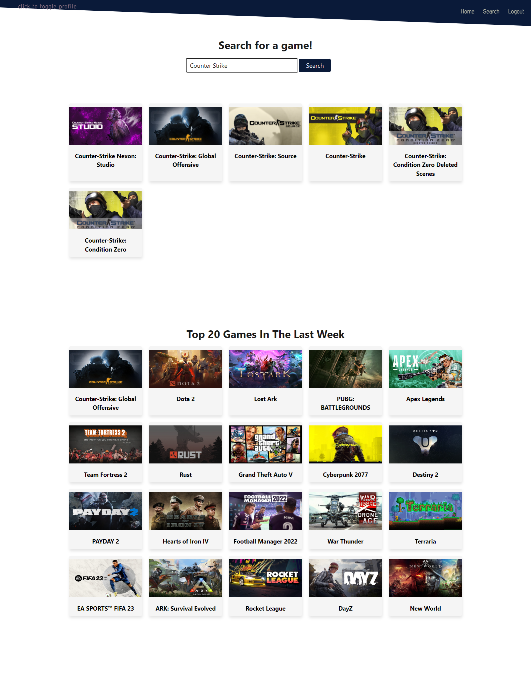
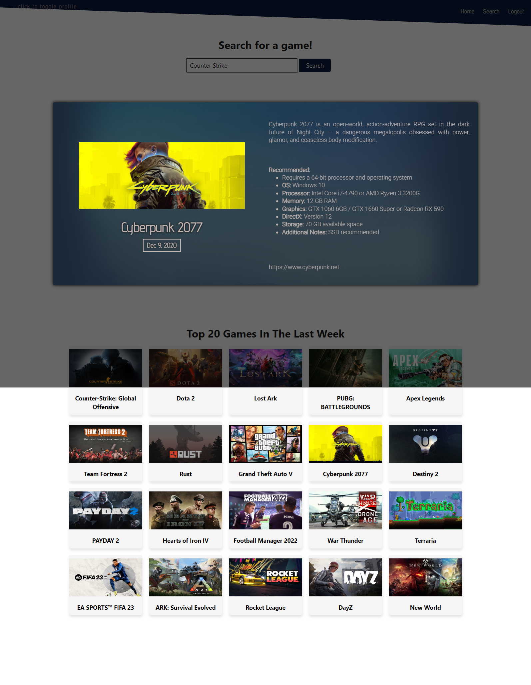

  

  
  

  

  
 ## Contributors to this project
 ### Jerrod Linderman, Jessica Lane, Garrett Lockhart, Alec Otterson

  

  

  
  

  
  
  <h1 align="center">Badges</h1>
  

  

  
  

  
  
  
  

  

  
  <h1 align="center" style="font-size:40px">
  
  UNPLAYABLE</h1>
  
  
  ## Table of Contents:
  1. [Description](#description)
  2. [Installation](#installation)
  3. [Usage](#usage)
  4. [How To Contribute](#contribute)
  5. [license](#license)
  6. [Tests](#tests)
  7. [Github](#github)
  8. [Email](#questions)

 

  ## Description
  Web application to see if your PC can play the games you want, Comapares your current pc specs to game requirements and gives you pass check if your system meets the requirements before you buy the game.

  ## Installation
  Clone repo install node, run npm i and then launch application using node server, go to localhost:3001 and browse.  Or our live webpage at unplayable.herokuapp.com.

  ## Usage
  Register an account, and update your profile with your computers specs, cpu, gpu and ram, it will take these values and compare to games on steam and let you know if your computer can run them, search for a game and click the card of the game you wish to play and it will compare your computers specs to the game specs recommended. 

 
  ## Contribute
  
  [Contributor Covenant](https://www.contributor-covenant.org/)

  At this time owner is not accepting any contributions to this project.

  ## License

  Published under the [MIT](license.txt) License.
  

  Read More about the licence by clicking this Link: [MIT](https://opensource.org/licenses/MIT).
 

  ## Tests
  no tests

  ## GitHub
  [nvmax](https://github.com/nvmax)

  [jessalane](https://github.com/jessalane)

  [garrettlockhart](https://github.com/GarrettLockhart)

  [alecotterson](https://github.com/acotterson)

  ## Questions
  If you have any questions, please contact us at our github pages.

  

 
